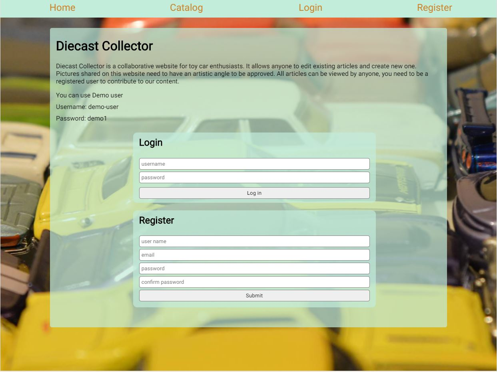
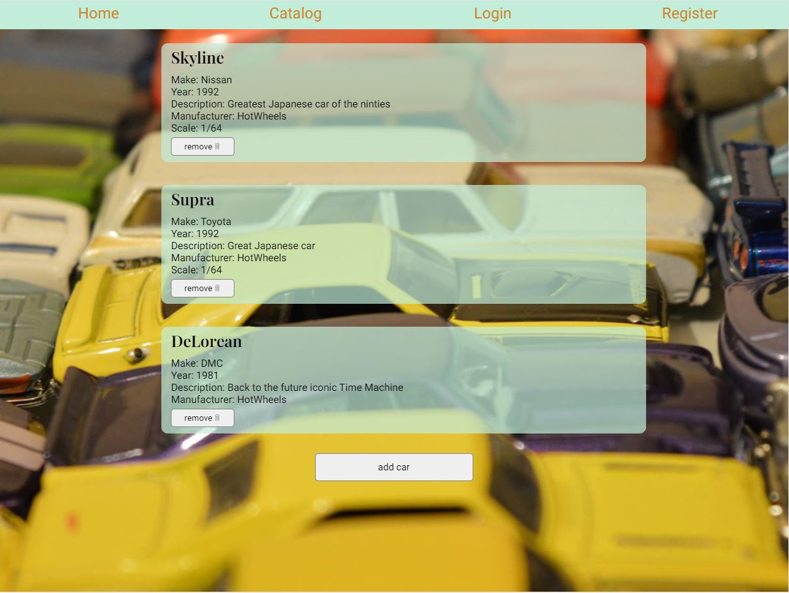
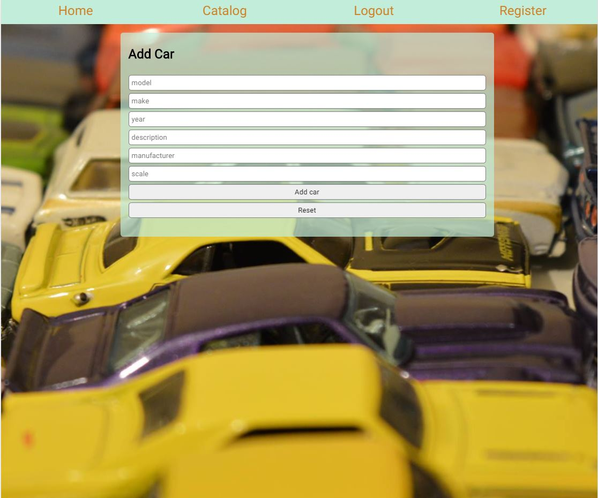

# Diecast Collector

You can visit the app here   
[Live Link](https://diecast-collector-client.vercel.app/)

## Summary
The app lets the diecast collectors have a library of diecast models
User can start by registering an account, then log in with said account.  
User can start adding cars  
User can delete cars
User can view a catalog of all cars   

## Technologies Used :
1. Javascript
2. Express
3. Node 
4. PostgreSql
5. React
6. HTML5
7. CSS 
8. Heroku for backend deployment
9. Vercel for frontend deployment
10. GitHub for repository management  

## Screenshots

Developed by Mahmood Nihad